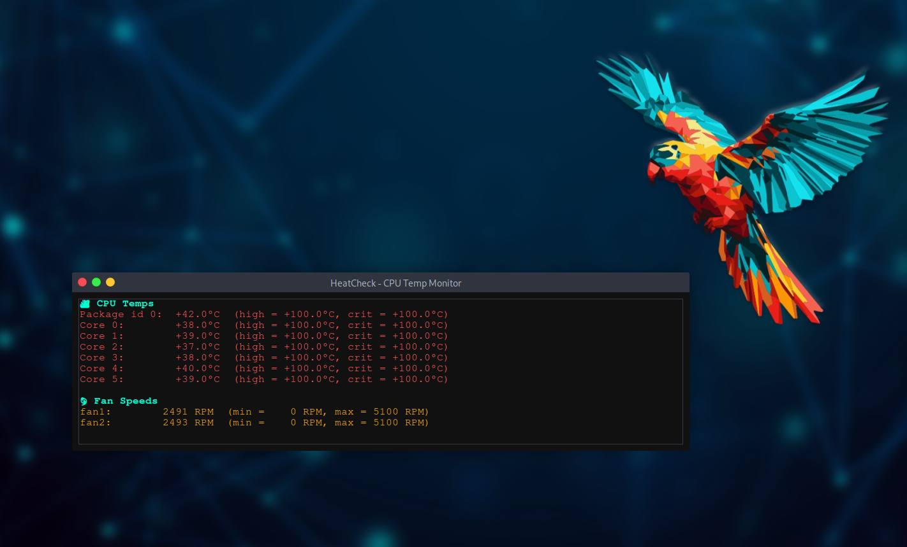

<!-- xonettn -->
<div align="center">

# 📦 🔥 HeatCheck GUI

A lightweight real-time CPU temperature and fan speed monitor for Linux, built in Python using Tkinter and `lm-sensors`.


</div>

---



## 🧠 Features

* 🔥 Real-time CPU core + package temps
* 🌀 Fan RPM display
* 🌙 Dark mode terminal-style GUI
* 🔄 Auto-refresh every 3 seconds
* 💻 Built with zero external dependencies

## 🚀 Installation

1. Install `lm-sensors`:

```bash
sudo apt install lm-sensors
sudo sensors-detect
```

2. Clone the repo:

```bash
git clone https://github.com/1nc0gn30/sensor-gui.git
cd sensor-gui
```

3. Run the app:

```bash
python3 sensor-show.py
```

## 📸 Screenshot


## ⚙️ Built With

* Python 3
* Tkinter
* `subprocess` + `sensors` parsing

## ⚙️ Future Features

* Desktop notifications on overheat
* Graph plotting with matplotlib
* Tray icon and system monitoring
* `.deb` packaging for easy install

---

**MIT License** | Made with ❤️ for hackers who love their hardware.

---

<div align="center">

**[xonettn]** · Built by [Neal Frazier](https://github.com/1nc0gn30) · [@AshAmplifies](https://twitter.com/AshAmplifies)

</div>
